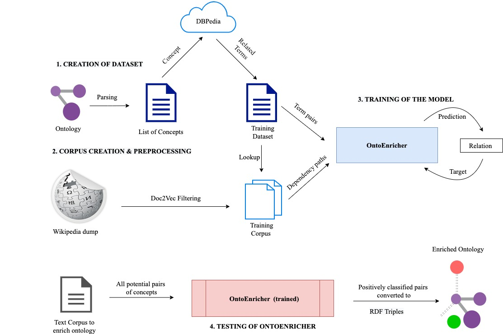

# OntoEnricher

An LSTM-based model to extract concepts and relationships from a text corpus to enrich a seed ontology.

## Methodology:

1.  First, I extracted the concepts from the seed (security) ontology and prepare a list of terms

2.  Then I extract the hypernyms and hyponyms of each of these concepts from online Wiki databases like DBPedia, Wikidata and Wordnet and build a dataset that consists of rows of (concept, hypernym) or (hyponym, concept) records.
    

  

3.  Each of these rows are validated by a domain expert and we mark the row as Hypernym/Hyponym/Synonym if and only if the relations belong to the same domain as the seed ontology and also share a hypernymy/hyponymy/synonymy relationship. Otherwise they are marked as None.
    

  

4.  I also added false negatives to our dataset to negatively score our models. For this, I extracted other relations from DBPedia apart from hypernymy and autotagged them as False.
    

  

5.  The above dataset of (concept, hypernym, label) or (hyponym, concept, label) relationships becomes our training dataset. The small dataset we created this way has 2155 training examples.
    

  

6.  We then proceed to construct our training corpus as follows:
    

	a.  For the domain “information security”, we extract all the terms in the Information Security category in the category box on this [page](https://en.wikipedia.org/wiki/Information_security)
	b.  Next, extract articles from the Wikipedia dump that contain one of the words from the above extracted list of terms.
  c.  These articles together form the training corpus
    

  

7.  The LSTM model uses the tagged training dataset and the corpus to learn the edge weights between every pair of noun phrases in a sentence. Edges that contain a hypernymy relationship get higher weights using path-based methods. The concepts get higher weights if they are related to Information Security domain, using distributional (word-embedding) methods. Thus we build an integrated (path-based + distributional) model that gives higher weights only to those relations that contain a hypernymy relationship AND are related to the information security domain.
    

  

8.  The next step is to build our testing dataset from the text corpus. This is done as follows:
    

	a.  First we implement [coreference resolution](https://github.com/huggingface/neuralcoref) on the text corpus as pre-processing. This is done to ensure that the entities being referred to in each sentence are noun phrases, making it easier to extract them for the purpose of building the testing dataset.
	    
	b.  Next, for each paragraph in the text corpus, all the noun phrases in that paragraph are extracted using the NLTK NE Grammar parser and a combinatorial pair-wise matching of each extracted entity is performed.
	    
	c.  After doing this for each paragraph, a testing dataset is constructed
    
	d.  Optionally, depending on the size of the document (and consequently, the size of the testing dataset), a few relations are filtered out based on their similarity (or dissimilarity) to “cybersecurity”
    

  

9.  The trained Bidirectional LSTM model is then used to predict the labels of the relations in the testing dataset. The non-None relations identified by the model are passed as input to the next stage of the pipeline, [OntoViewer](https://github.com/Remorax/SIREN-Research/tree/master/OntoViewer).

10. Hyper parameters used for training the model

| Hyperparameters | Information Security | Pizza |
|:-:|:-:|:-:|
| Activation Function  | Log Softmax | Log Softmax |
| Number of Layers  | 2  | 2 |
| Hidden Dimension of LSTM  | 180 | 250 |
| Input Dimension (2nd NN)  | 120  | 90 |
| Embedding layer Dropout  | 0.35  | 0.35 |
| Hidden layer Dropout  | 0.8  | 0.8 |
| Hidden layer Dropout  | 0.8  | 0.8 |
| Optimizer  | AdamW  | AdamW |
| Loss function  | NLL Loss  | NLL Loss |
| Epochs  | 200  | 200 |
| Learning Rate  | 0.001  | 0.001 |
| Weight Decay  | 0.001  | 0.001 |
| Weight Initialization  | Xavier  | Xavier |

Check their READMEs for more info about how to setup and run this project 
