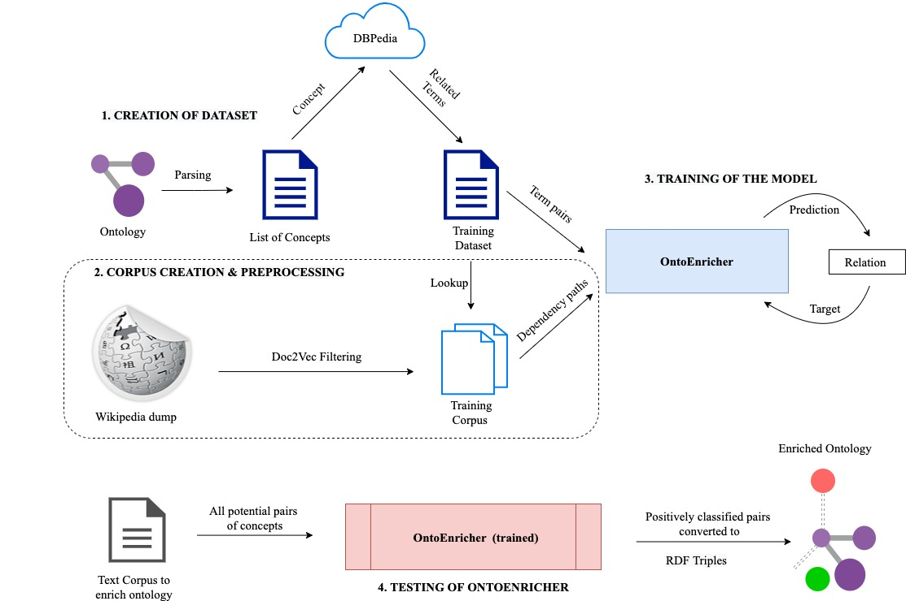

# README

## About

This repository contains code for: i) creation of the domain specific corpus from the Wikipedia dump and ii) preprocessing this corpus to create db files that store dependency paths for a large variety of term pairs. 

### Corpus Creation
We create our corpus by extracting all relevant articles corresponding to the terms in the dataset extracted from DBPedia. Additionally, the doc2vec similarity of articles wrt the Wikipedia article on [information security](https://en.wikipedia.org/wiki/Information_security) is compared and if this similarity is more than an empirically determined threshold, we write it to the corpus. 

### Corpus Preprocessing
The extacted corpus is now preprocessed to generate dependency paths. At first, for every pair of noun chunks occuring together in a sentence, the dependency paths between them are extracted. Since this can lead to large number of paths, they are filtered by: 
1. Path Length: only paths with length less than `max_path_length` are considered
2. Frequency: only paths with frequency greater than `min_frequency` are considered
Terms having these filtered paths between them are stored in a database in such a way that given a pair of terms, the database returns the filtered paths between them, if any. 
All in all, five pickle files, each containing a separate dictionary, are created:
1. `<domain_name>_w2i.pkl`: Maps word occuring in corpus to unique ID
2. `<domain_name>_i2w.pkl`: Maps ID back to word occuring in corpus
3. `<domain_name>_p2i.pkl`: Maps (frequently occuring) path in corpus to unique ID
4. `<domain_name>_i2p.pkl`: Maps ID back to (frequently occuring) path
5. `<domain_name>_relations.pkl`: Maps a pair of terms to all paths occurring between them.

## How to run

### Corpus Creation

Run this command:

`python3 WikiExtractor.py <wiki_dump> -d <doc2vec_model> -terms <terms_file> -t <threshold> --doc <base_file> -o - > <output_file>`

where:

1. `<wiki_dump>`: refers to the path to the Wikipedia dump file
2. `<doc2vec_model>`: refers to the path to the binary file of the doc2vec model used for similarity comparison. In our experiments, we use the [pretrained model](https://ibm.ent.box.com/s/9ebs3c759qqo1d8i7ed323i6shv2js7e) from the Associated Press News corpus.
3. `<terms_file>`: refers to the path containing the related terms file extracted from DBPedia
4. `<threshold>`: refers to the doc2vec similarity threshold used for filtering articles. (value: 0.29 in our experiments)
5. `<base_file>`: refers to the file against which doc2vec similarity is compared for every article. Should be present in .txt format. (For our experiments, we used `../../files/security.txt` , scraped from [Wikipedia](https://en.wikipedia.org/wiki/Information_security))
6. `<output_file>`: refers to the file created for storing domain-specific corpus.

### Corpus Preprocessing

Run the following commands:
1. `mkdir <output_folder>`
2. `./preprocess.sh <corpus_path> <output_folder> <db_prefix>`

Here:

1. `<output_folder>`: Refers to the folder which will contain the preprocessed DB files, stored in pickled format. 
2. `<corpus_path>`: Refers to the path to the extracted corpus from the previous step.
3. `<db_prefix>`: Refers to the prefix the created DB files will have. 

## Credits

For doc2vec similarity, we use the [pre-trained Doc2Vec model](https://ibm.ent.box.com/s/9ebs3c759qqo1d8i7ed323i6shv2js7e) trained on Associated Press News corpus.

For extraction of articles from Wikipedia, we build our parser on top of the excellent Wikipedia parsing script from the [WikiExtractor repository](https://github.com/attardi/wikiextractor) made by [Giuseppe Attardi](https://github.com/attardi).