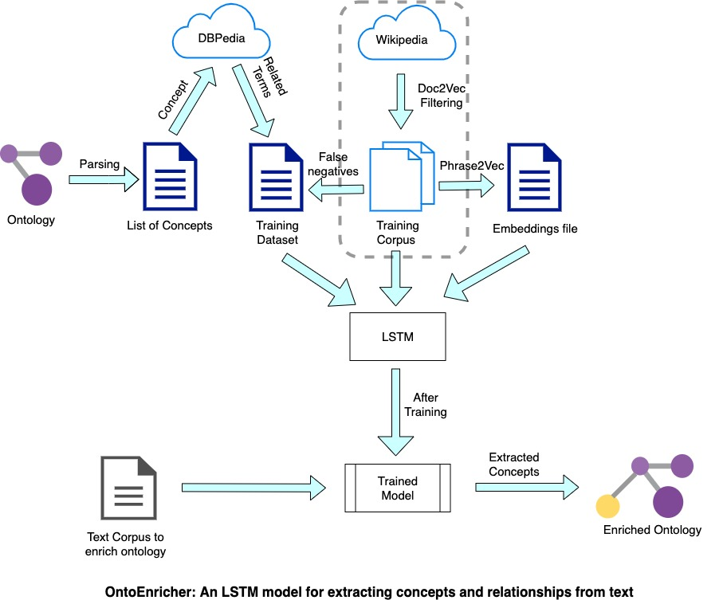

# README

This repository contains code for extraction of the domain specific corpus from the Wikipedia dump. We do this by comparing the doc2vec similarity of the document with Wikipedia articles on information security and if this similarity is more than an empirically determined threshold, we write it to the corpus. 

For doc2vec comparison, we use the [pre-trained Doc2Vec model](https://ibm.ent.box.com/s/9ebs3c759qqo1d8i7ed323i6shv2js7e) trained on Associated Press News corpus.

Alternatively, if the article is on one of the terms in the dataset, we still consider it and write it to the corpus.

For extraction of articles from Wikipedia, we used and edited from the excellent [WikiExtractor repository](https://github.com/attardi/wikiextractor) made by [Giuseppe Attardi](https://github.com/attardi).