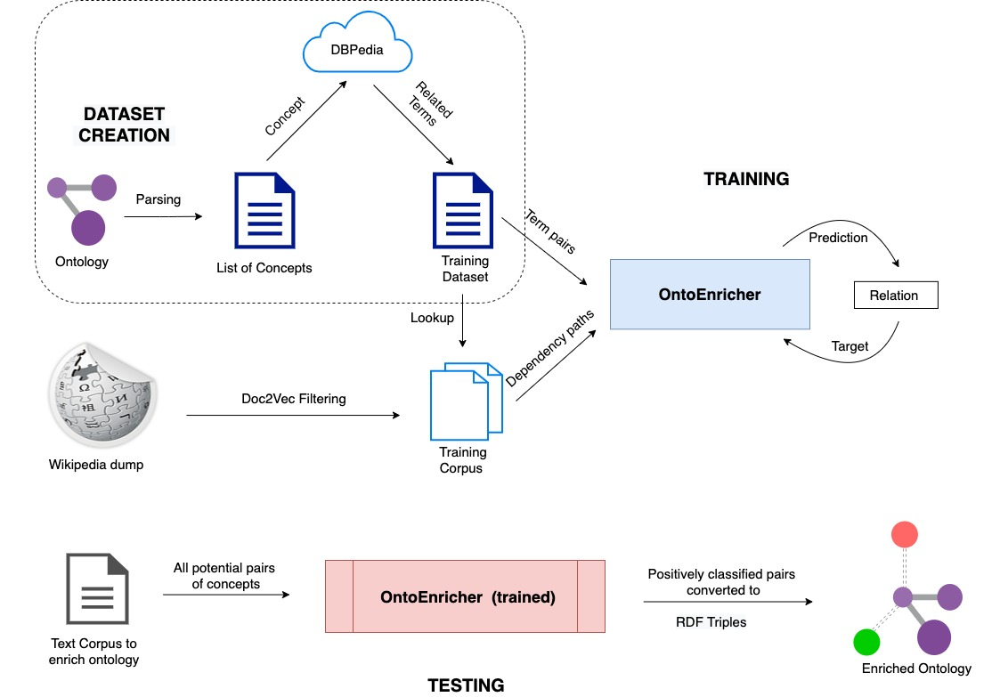

# README

This repository contains code for creation of the dataset.
As shown in the figure:

## Step 1: Ontology Parsing

The first step is parsing ontologies to extract a list of concepts. Ensure that the relevant domain and list of ontologies are entered in `config.ini`. Then, execute by running `python3 extract_concepts_from_ontology.py`. The concepts are saved in a file called `concepts_<domain_name>.txt` inside `../../files/`

## Step 2: DBPedia Extraction

The next step is extracting related terms, namely hypernyms and hyponyms, for all of these concepts from DBPedia. Ensure that the relevant domain and list of concepts are entered in `config.ini`. Then, execute by running `python3 extract_terms_from_dbpedia.py`. The terms from DBPedia are now stored in a file called `dbpedia_terms_<domain_name>.tsv` located inside `../../files/`

The terms extracted from xDBPedia need to be manually validated by a domain expert as Hypernym/Hyponym/Concept/Instance/None depending on how the two terms are related to each other.

## Step 3: Dataset Creation

After manual validation, the datasets are created by splitting the entire list of terms into training and testing sets. Ensure that the relevant domain and list of annotated terms are entered in `config.ini`. Then, execute by running `python3 create_dataset_from_labelled_terms.py`. Training and test datasets are inside a directory called `dataset` located inside `../../files/`.