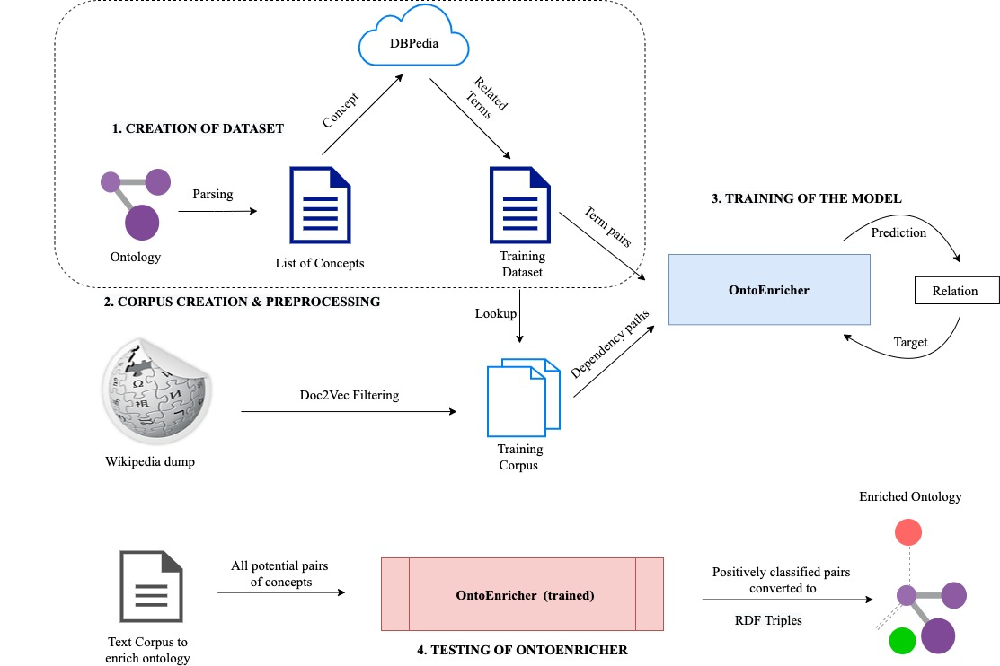

# README

This repository contains code for creation of the dataset.
As shown in the figure, 

## Stage 1: Ontology Parsing

The first step is parsing ontologies to extract a list of concepts. Ensure that the relevant domain and list of ontologies are entered in `config.ini`. Then, execute by running `python3 extract_concepts_from_ontology.py`. The concepts are saved in a file called `concepts_<domain_name>.txt`

## Stage 2: DBPedia Extraction

The next step is extracting hypernyms, hyponyms and synonyms for all of these concepts  from DBPedia. Ensure that the relevant domain and list of concepts are entered in `config.ini`. Then, execute by running `python3 extract_terms_from_dbpedia.py`. The relations from DBPedia are now stored in a file called `terms_from_dbpedia_<domain_name>.tsv` 

The terms extracted from DBPedia need to be manually validated by a domain expert as Hypernym/Hyponym/Synonym/None depending on the label of the relation.

## Stage 3.1: Dataset Creation

After manual validation, the dataset is created by splitting the entire list of terms into training, testing and validation sets. Ensure that the relevant domain and list of annotated terms are entered in `config.ini`. Then, execute by running `python3 create_dataset_from_labelled_terms.py`. The T/F datasets are created in a directory called `train_tf` and multi-class datasets are created in a directory called `train_multi`.

## Stage 3.2: False Negatives Extraction

The next stage is to generate false negatives for a sentence. Ensure that the relevant details for dataset, model and domain are entered in `config.ini`. Then, execute by running `python3 extract_false_negatives.py`. The false negatives are directly added to the dataset created in stage 3.1.

## Stage 3.3: Testing Dataset Extraction from Corpus

So far, we took testing corpus as a subset of training corpus to calculate model performance. But during production, the term pairs will be extracted from a text corpus and classified by the LSTM model appropriately. This contains a script for that purpose.

Ensure that the relevant details for dataset, model and domain are entered in `config.ini`. Then, execute by running `python3 extract_testing_dataset.py`. The concepts are saved in a file called `test_alt.tsv` in the `train_tf` and `train_multi` directories created in stage 3.1.

`subject_verb_object_extract.py` is used for SVO extraction and is taken from [here](https://github.com/peter3125/enhanced-subject-verb-object-extraction/blob/master/subject_verb_object_extract.py)