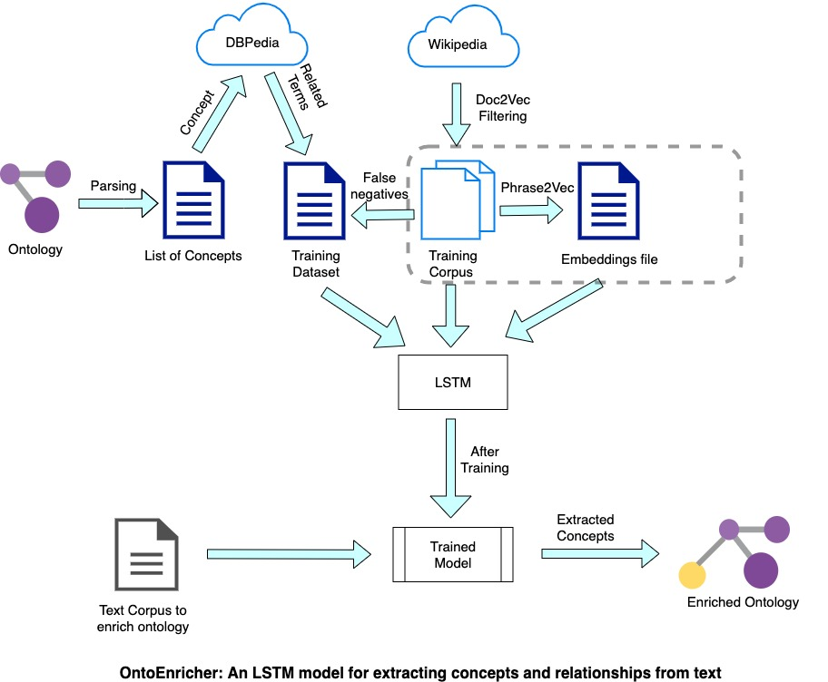

# README

This repository contains code for creation of a Phrase2Vec word embeddings file created by:
1. phrase-tagging the domain-specific corpus extracted in `corpus-creation`
2. Training a word2vec model on this phrase-tagged corpus

We use these custom trained domain-specific Phrase2Vec embeddings, along with the [GloVe embeddings](https://nlp.stanford.edu/projects/glove/) in our experiments to compare the performance.
