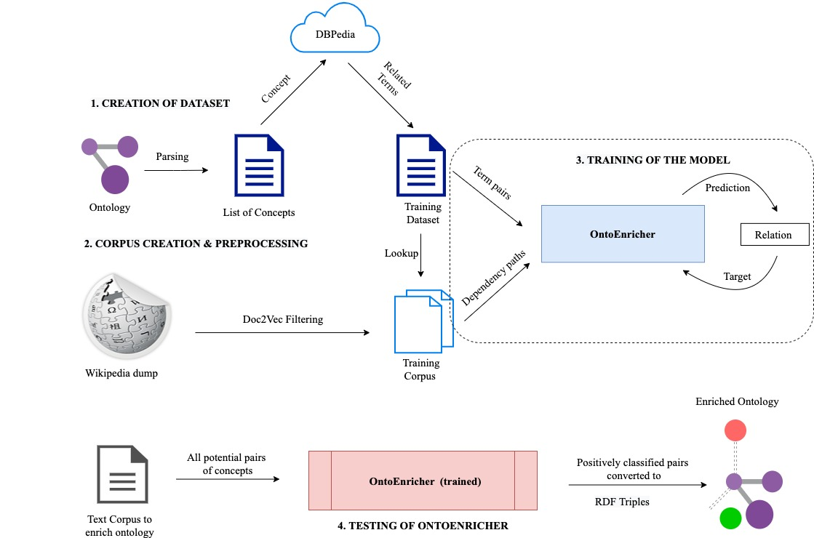

# README

## About 

The process diagram for the training OntoEnricher is given above. Having obtained a tagged training dataset from DBPedia from the scripts in `dataset-creation` and a domain-specific corpus with preprocessed files from `corpus-creation-preprocessing`, the next stage involves training OntoEnricher to predict relation between concepts, based on the paths given in the corpus.

Apart from these files, for terms present in dataset which do not have an exact match in the db files, we additionally also try to resolve these dataset terms to the closest word present in db files, if their similarity is more than `resolve_threshold`. This is done while training to improve model performance. However, sometimes finding closest word from a large corpus can be a time-consuming process. Since this resolution is done only once, during training, it can be worth the time cost to yield a better trained model, hence it is made available but this stage is entirely **optional** and decent results are expected without resolution as well.

The architecture diagram of OntoEnricher is given over [here](Architecture.jpg).

## Running 

1. Ensure the preprocessed pickle files obtained through `corpus-creation-preprocessing` are in the directory `../files/preprocessing/<domain_name>/` 

2. Ensure the datasets are in `../files/datasets`. There SHOULD be a `train.tsv` for training OntoEnricher. Additionally, there CAN be `test.tsv` and `test_knocked.tsv` for evaluating the performance of the model on DBPedia terms and knocked-out concepts from the ontology respectively. However, this is optional.

3. For running closest entity resolution, as described [here](#about), please run `closest_resolution.py`. As mentioned, this stage is optional and would lead to better performance at the cost of time.

4. Ensure `config.ini` contains relevant values for all model parameters and hyperparameters. The best determined parameters for pizza and security datasets are given [below](#configurational-values)

4. Run `python3 main.py`.

## Configurational Values

Best fit hyperparameters after grid search:

| Hyperparameter    | Security | Pizza |
|-------------------|----------|-------|
| resolve_threshold | 0.86     | 0.86  |
| emb_dropout       | 0.35     | 0.35  |
| hidden_dropout    | 0.8      | 0.8   |
| NUM_LAYERS        | 2        | 2     |
| HIDDEN_DIM        | 180      | 250   |
| LAYER1_DIM        | 120      | 90    |
| lr                | 0.001    | 0.001 |
| weight_decay      | 0.001    | 0.001 |
| epochs            | 200      | 200   |
| batch_size        | 8        | 32    |